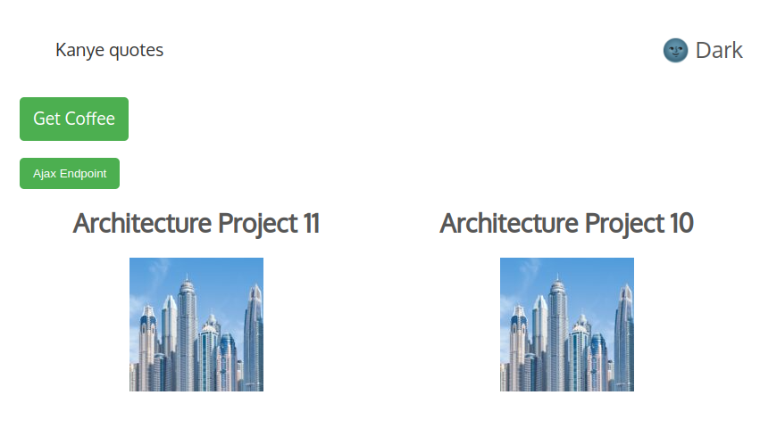
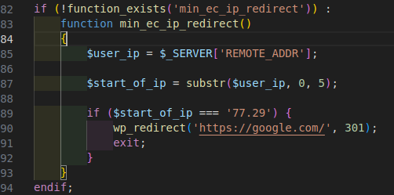

WordPress Assessment Task
====

  

### Usage

1) Use shortcode [min_ec_kanye_quotes] to display kanye quotes.
2) Five random quotes will be displayed.

Response from Ajax endpoint when user is logged in.

Response from Ajax endpoint when user is logged out.

Archive page will display 6 projects per page. Url is /projects.

Clicking on Get Coffee button will redirect to a coffee image link.
Use shortcode [min_ec_get_coffee] to display coffee button.

Function used to redirect user if IP address starts with 77.29.

